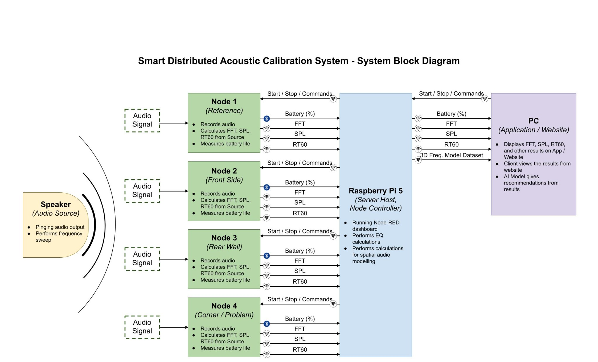
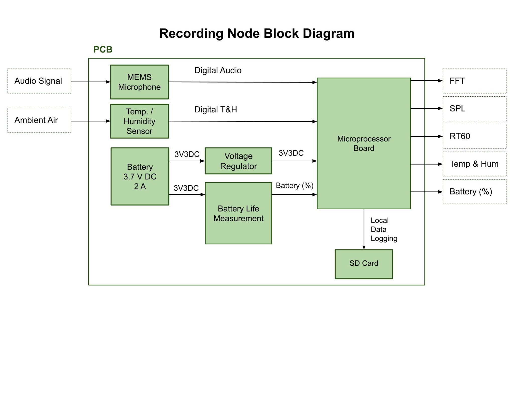
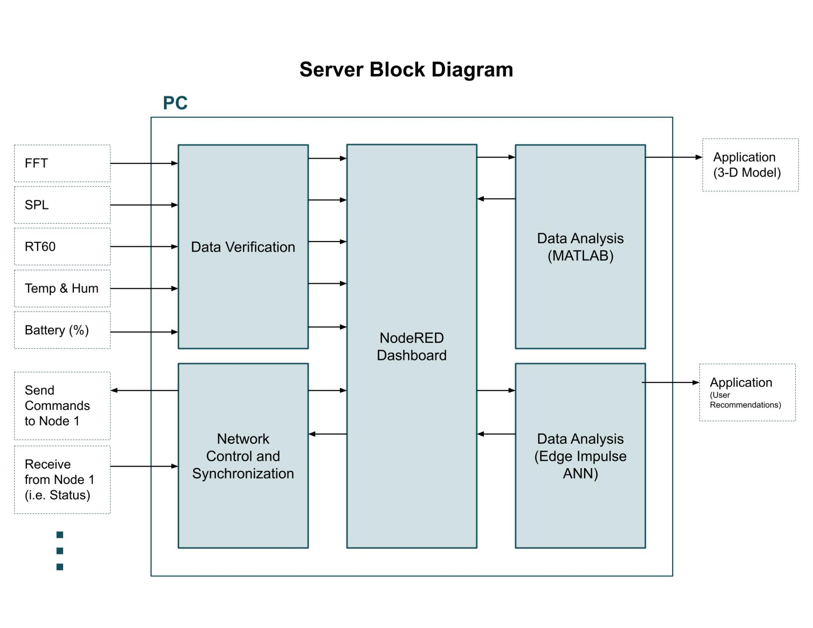
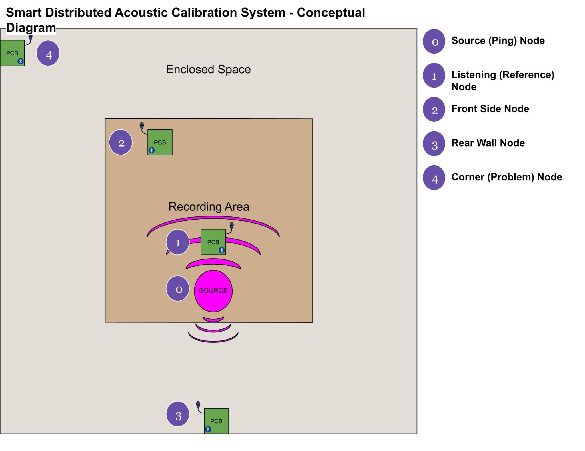
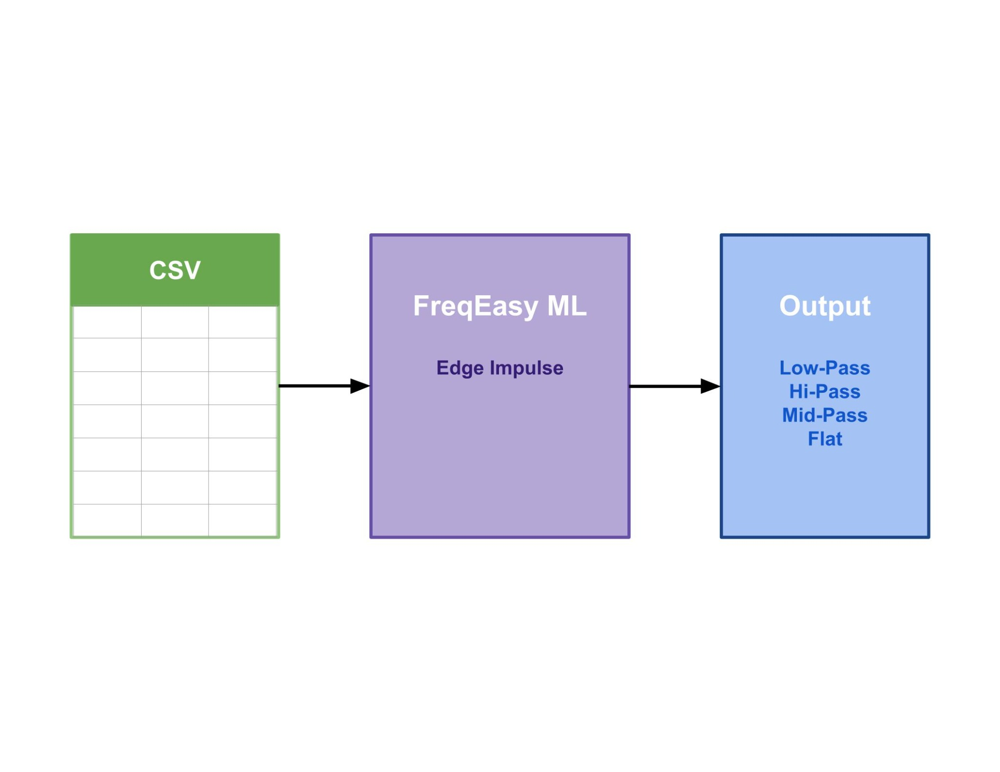

# Kyle Dick

## Electronic Systems Engineering | Embedded Firmware | Hardware Integration

I am an Electronic Systems Engineering B.Eng. candidate with hands-on
experience developing embedded systems using ESP32-S3, STM32 and Raspberry Pi
platforms.

My work includes embedded C firmware, sensor integration, PCB design,
communication interfaces, MQTT telemetry, Linux-based edge systems, signal
processing, hardware bring-up, testing and technical documentation.

I am currently seeking embedded firmware, electronics design, test engineering
and hardware-software integration opportunities.

## Contact

[View Resume (PDF)](Documents/Kyle%20Dick%20Firmware%20Developer%20Resume.pdf) |
[LinkedIn](https://www.linkedin.com/in/kyle-dick-6287abc/) |
[Email](mailto:kyle.david.dick@gmail.com)

## Featured Projects

### Smart Distributed Acoustic Calibration System

**ESP32-S3 | Embedded C | ESP-IDF | I2S | I2C | FFT | MQTT | Raspberry Pi**

SDACS is a distributed acoustic measurement system developed to collect and
analyze room-acoustic information using multiple wireless sensor nodes.

Each node uses an ESP32-S3 and an I2S MEMS microphone to acquire audio,
calculate acoustic features and transmit measurements to a Raspberry Pi-based
backend.

#### My Contributions

- Developed ESP-IDF firmware in C for ESP32-S3 sensor nodes.
- Integrated I2S microphone acquisition and environmental sensors.
- Implemented RMS, dBFS and 2048-point FFT feature calculations.
- Published acoustic and environmental telemetry through MQTT over Wi-Fi.
- Integrated sensor nodes with Mosquitto and Node-RED on Raspberry Pi/Linux.
- Diagnosed firmware, Wi-Fi and MQTT communication problems using serial logs
  and bench testing.
- Contributed to calibration, validation and engineering test procedures.
- Used Git/GitHub for branch-based development and team integration.

#### System Architecture

<strong>View additional SDACS diagrams</strong>

#### Recording Node Functional Block Diagram

#### Server Functional Block Diagram

#### Conceptual Node Placement Diagram

#### FreqEasy Machine-Learning Pipeline

#### Supporting Documents

- [Firmware Architecture Overview (PDF)](Documents/Kyle_Dick_SDACS_Firmware_Architecture_README.pdf)
- [Engineering Design and Test Plan (PDF)](Documents/SDACS_EngineeringDesign%26TestPlan.pdf)
- [SDACS Test Report (PDF)](Documents/SDACS_Test_Report.pdf)
- [Project Proposal (PDF)](Documents/Group2_ProjectProposal_updated.pdf)
- [Interim Status Report (PDF)](Documents/KD_Interim_Status_Report.pdf)
- [Summary of Work (PDF)](Documents/SDACS_SummaryofWork.pdf)
- [Remote Flutter Access and Tailscale Guide (PDF)](Documents/SDACS_Remote_Flutter_Access_Tailscale_Guide.pdf)

#### Software, Data and Presentations

- [Node-RED Flow (JSON)](Node-RED%20Flow/SDACS_flow.json)
- [Design and Testing Presentation (PDF)](Presentations/SDACS_Design%26Testing_Presentation.pdf)
- [TinyML Presentation (PDF)](Presentations/TINYML%20Presentation.pdf)
- [Edge Impulse Dataset Documentation](SDACS%20Datasets/SDACS_Edge_Impulse_Ready_Dataset/SDACS_CLEANING_AND_FINALIZATION_REPORT.md)
- [Edge Impulse Feature Dictionary (CSV)](SDACS%20Datasets/SDACS_Edge_Impulse_Ready_Dataset/feature_dictionary.csv)
- [Node-Level Training Dataset (CSV)](SDACS%20Datasets/SDACS_Edge_Impulse_Ready_Dataset/sdacs_ei_node_training.csv)
- [Room-Fused Training Dataset (CSV)](SDACS%20Datasets/SDACS_Edge_Impulse_Ready_Dataset/sdacs_ei_room_fused_training.csv)
- [MATLAB Telemetry Dataset (CSV)](SDACS%20Datasets/MATLAB_Node04_For_Amy/sdacs_matlab_relevant_telemetry.csv)
- [MATLAB Dataset Guide (PDF)](SDACS%20Datasets/MATLAB_Node04_For_Amy/SDACS_MATLAB_Guide_for_Amy_v2.pdf)

### CONTADA Embedded Telemetry and Control Platform

**ESP32 | STM32 | Raspberry Pi | Sensors | MQTT | CAN | Modbus | MATLAB**

CONTADA is a wind-energy and battery-storage research platform developed
through a collaboration between Purus Power and the Conestoga SMART Centre.

The project required the integration of embedded sensing, edge processing,
communications, instrumentation and engineering test equipment.

#### My Contributions

- Contributed to the design of a multi-device telemetry and control architecture.
- Developed and tested ESP32 and STM32 embedded sensor interfaces.
- Integrated BME680, BNO085 and ADXL335 sensing hardware.
- Investigated CAN, Modbus, RS485, Ethernet and MQTT communication paths.
- Integrated measurements with Raspberry Pi, Mosquitto and Node-RED services.
- Created MATLAB/Simulink models for sensor-driven control and validation.
- Interpreted schematics, sensor datasheets and interface documentation.
- Performed bench testing using oscilloscopes, multimeters and power supplies.
- Presented engineering progress and technical recommendations to the client
  and SMART Centre team.

#### Supporting Document

- [Embedded Systems Technical Summary (PDF)](Documents/Kyle_Dick_CONTADA_Embedded_Systems_Technical_Summary.pdf)

### Multi-Processor Elevator Control System

**STM32 | C | CAN | Raspberry Pi | UART | Motor Control**

- Implemented CAN communication across STM32, Raspberry Pi, Arduino and motor
  controller hardware.
- Developed embedded C firmware for control and safety functions.
- Integrated a Raspberry Pi-based interface using PHP and JSON.
- Implemented emergency-call and input-lockout functionality.
- Tested communication and system behaviour across multiple processors.

### Mobile Robot Control Platform

**Altium Designer | Embedded C | UART | PCB Design | Motor Control**

- Designed and assembled custom PCBs for power and control subsystems.
- Developed C firmware for DC, stepper and servo motor control.
- Implemented RS232/UART communication with a Raspberry Pi.
- Performed board bring-up and hardware debugging using laboratory equipment.
- Integrated electrical, mechanical and software subsystems into a working
  mobile robot.

## Current Development

I am currently improving the SDACS platform through:

- Additional acoustic calibration and frequency-response testing
- Refinement of the labelled machine-learning dataset
- More reliable MQTT and Wi-Fi fault handling
- Structured hardware-interface testing
- Improved firmware documentation
- Expansion of the GitHub repositories with reviewed code samples

## Technical Skills

**Firmware and programming:** C, C++, Python, ESP-IDF, STM32 development,
MATLAB/Simulink, JSON

**Embedded platforms:** ESP32-S3, STM32, Raspberry Pi, Arduino, embedded Linux

**Interfaces and networking:** I2C, I2S, UART/RS232, CAN, SPI, Ethernet,
Wi-Fi, MQTT and Modbus

**Hardware development:** Altium Designer, schematic capture, PCB layout,
board assembly, soldering, hardware bring-up and datasheet interpretation

**Testing and tools:** Git/GitHub, Visual Studio Code, Node-RED, oscilloscope,
multimeter, bench power supply, serial debugging and technical test procedures

Trigger GitHub Pages deployment
